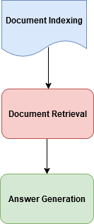

## RAG Architecture

## Objective
This project demonstrates a RAG (Retrieval-Augmented Generation) architecture combining information retrieval and natural language generation to enhance AI responses.

## Technologies Used
- Libraries:
  - Transformers
  - Sentence-TransformersFAIS
  - FAISS
- Pre-trained Models: T5-small and all-MiniLM-L6-v2

## Workflow
1. **Document Indexing:**  Generate embeddings for documents.
2. **Document Retrieval:** Search for relevant documents using FAISS.
3. **Answer Generation:**  Generate responses using the T5 model based on retrieved documents.

## Workflow Diagram
Langflow design for Tavily search agent.



## 📖 Example Usage

### Run

```bash
python main.py
Question: What is Bitcoin?
Answer: digital currency

## 🙌 Credits

This project was based on the original repository "Projetos Práticos de IA" by Scoras Academy.

## 📝 License

This project is licensed under the [MIT](LICENSE) license.


