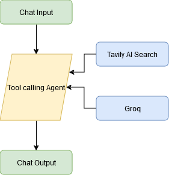

## Interactive Tavily Search Agent with Grob Chat Integration

## Objective
The objective of this code is to learn the Langflow fundamentals using the Tavily as a search agent that integrates with Grob.

## Flowchart
Langflow design for Tavily search agent.

